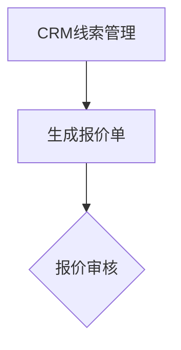

# OdooCC Markdown 编辑器（`occ_markdown`）

本模块把 Markdown 转换、单窗口所见即所得写作、图片/B站插入和 HTML 富文本
`/Markdown` 命令封装为 Odoo 19 基础组件。Markdown 始终是字段中的唯一存储源；编辑预览
只辅助写作，最终保存或插入的 HTML 统一由服务端转换。

## 安装与外部依赖

模块直接依赖 `html_editor`、`occ_base_bilibili` 和 Python `Markdown==3.10.3`。仓库根目录
的 `requirements.txt` 已固定版本：

```bash
python -m pip install -r addons_odoocc/requirements.txt
./odoo-bin -d <数据库名> --addons-path=addons,addons_odoocc \
    -i occ_markdown --stop-after-init
```

Vditor 3.11.3 以 MIT 许可证最小化内置，不使用 CDN。版本、来源、npm SHA-512 完整性和
许可证见 `static/lib/vditor/NOTICE.md` 与 `LICENSE`。

## 服务端转换接口

```python
html = env["occ.markdown.service"].convert_markdown(
    markdown_text,
    {
        "strip_emoji": False,
        "create_toc": False,
        "allow_bilibili": True,
    },
)
```

支持标题、列表、表格、链接、图片、引用、代码块、删除线、Emoji 清理、中文“目录”、
Mermaid 流程图和B站标记。原始 HTML、危险链接和危险属性会被清理；表格、引用、代码、图片和B站播放器使用
语义 HTML 及 Odoo/Bootstrap 类，不写品牌字体或正文颜色。

B站标记必须独占一行：

```markdown
{{bilibili:BV1xx411c7mD}}
{{bilibili:BV1xx411c7mD|page=2}}
{{bilibili:av170001}}
```

流程图使用标准 Mermaid `flowchart` 代码块；当前只开放 flowchart 方向图，禁用 click、
初始化指令和脚本协议：

````markdown

````

## 字段组件

业务模型使用 `fields.Text` 保存 Markdown，并把选项字段同时放入视图：

```xml
<field name="markdown_strip_emoji"/>
<field name="markdown_create_toc"/>
<field name="markdown_source"
       widget="occ_markdown"
       options="{'strip_emoji_field': 'markdown_strip_emoji',
                 'create_toc_field': 'markdown_create_toc',
                 'enable_images': True,
                 'enable_bilibili': True}"/>
```

默认只显示一个可编辑的“所见即所得”窗口，可切换到“Markdown 源码”或只读“服务端效果”；
切换不会丢失未保存内容。输入后约 500ms 防抖更新服务端效果与错误状态。

## 图片、媒体库与B站

- 粘贴 HTTP(S) 图片地址或网页图片会插入 Markdown 图片。
- 从飞书、网页复制 HTML 表格，或从 Excel 复制制表符表格，会自动转换为 Markdown 表格；
  HTML 表格中的粗体、斜体、代码、链接和网络图片会尽量保留。
- 直接粘贴以 `flowchart TD/TB/BT/LR/RL` 开头的流程定义，会自动补成 Mermaid 代码块。
- 粘贴本地截图/图片会上传为当前记录附件；私有附件 URL 自动带访问令牌。
- 图片按钮复用 Odoo 媒体库。新记录未保存时禁用本地上传并显示中文说明，网络图片仍可用。
- 粘贴合法B站地址、BV 或 av 自动生成规范标记；也可点击“B站视频”按钮；插入后立即打开可播放预览。
- 写作模式显示带播放入口的视频预览卡片；卡片本身不请求B站，用户点击后可再次在预览窗口加载
  B站播放器。服务端效果输出带
  `occ_bilibili_embedded_video` 类的响应式播放器，供 `occ_website_cn` 接管 Cookie 阻断。

所有后台 HTML 富文本字段会增加 `/Markdown` Powerbox 命令。命令打开同一编辑器，确认时
重新调用服务端转换器并在当前光标插入最终 HTML；不包含 Knowledge 子文章拆分。

## 权限、安全与生产注意事项

`occ.markdown.service` 是无持久数据的 `AbstractModel`，不创建宽泛 ACL。RPC 仍遵循当前
登录会话；图片上传和媒体选择遵循 `ir.attachment` 及目标记录权限。服务端只信任固定B站
播放器域名，其他输入经 Odoo HTML 清理。业务模块必须自行控制 Markdown 字段的读写、发布
权限和最终 HTML 存储字段，不能把客户端预览当安全边界。

## 升级、卸载与测试

升级前备份数据库和附件目录，并在业务数据库副本中回归所有使用该 widget/API 的模块：

```bash
./odoo-bin -d <数据库名> --addons-path=addons,addons_odoocc \
    -u occ_base_bilibili,occ_markdown --stop-after-init

./odoo-bin -d <测试数据库> --addons-path=addons,addons_odoocc \
    -u occ_markdown --test-enable --test-tags=/occ_markdown --stop-after-init

./odoo-bin -d <测试数据库> --addons-path=addons,addons_odoocc \
    -u web,occ_markdown --test-enable \
    --test-tags='/web:WebSuite.test_unit_desktop[@occ_markdown]' --stop-after-init
```

模块没有业务记录；卸载前必须先移除业务视图中的 `widget="occ_markdown"` 和依赖声明。已有
Markdown、附件及已生成 HTML 属于调用模型，不会由本模块自动迁移或删除。

`occ_markdown_test` 只供非生产验收，入口为“设置 → OdooCC Markdown 编辑器验收 →
Markdown 编辑工作台”。

## English summary

`occ_markdown` provides an Odoo 19 server-side Markdown conversion API, a single-window
Vditor-based WYSIWYG/source/server-result field widget, image and Bilibili insertion, and a
global HTML-editor `/Markdown` command. Markdown remains the sole field source, final HTML is
always produced by the same sanitized server converter, and consuming modules retain their own
record and publishing permissions.

## 许可证与联系

- 作者：Odoo老赵
- 官网：<https://odoocc.com>
- 支持邮箱：<156277468@qq.com>
- 许可证：[GNU Affero General Public License v3.0](../LICENSE)
